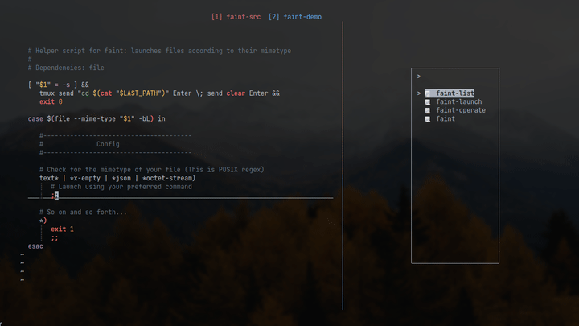
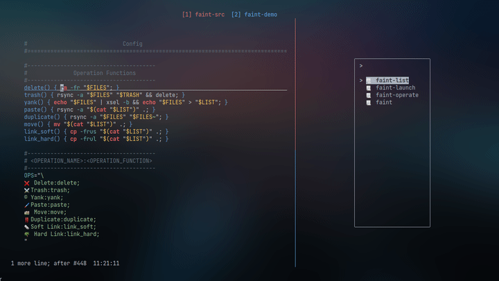
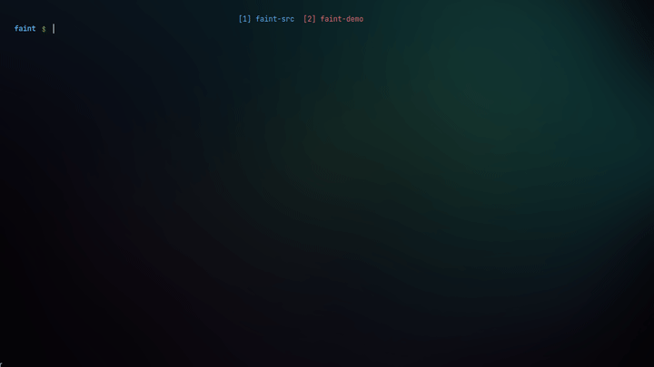

# faint: Extensible TUI fuzzy file explorer

**faint** is a fuzzy file explorer for the CLI with scriptable operations & launch behaviors

## Features

-  ### Fuzzy Finding, Depth Searching & Forward-Backward Navigation.


-  ### Scriptable Launch Behaviors



-  ### Scriptable Operations



-  ### Filtering & Icons



## Dependencies

-  [fzf](https://github.com/junegunn/fzf)
-  `find, sed, awk, & file`

## Installation

```sh
git clone https://github.com/salman-abedin/faint.git && cd faint && sudo make install
```

## Usage

### Commands

| Command                | Effect                          |
| ---------------------- | ------------------------------- |
| `faint`                | Explore current directory       |
| `faint <PATH>`         | Explore specified directory     |
| `faint -l`             | Explore last visited directory  |
| `faint -d <DEPTH>`     | Explore nested files            |
| `faint -n`             | No Filtering                    |
| `faint -d 3 -n <PATH>` | Command Overloading is possible |

### Default Bindings

| Key     | Effect                                               |
| ------- | ---------------------------------------------------- |
| `;`     | `cd` into the directory or launch the file           |
| `,`     | `cd` back                                            |
| `space` | Pops open the operations menu for the selected files |
| `esc`   | Clears the query or quits the program                |
| `enter` | Drops down to shell on the last visited directory    |
| `tab`   | Mark files                                           |
| `btab`  | Unmark files                                         |

### Modifications

-  Consult the `faint-config` script for all your modifications need
-  **Reinstall** after making changes

## Update

```sh
cd faint
git pull rebase && sudo make install
```

## Uninstallation

```sh
cd faint
sudo make uninstall
```

---

## Shameful Plug

| Name                                                    | Description                     |
| ------------------------------------------------------- | ------------------------------- |
| [devour](https://github.com/salman-abedin/devour)       | X11 window swallower            |
| [bolt](https://github.com/salman-abedin/bolt)           | The launcher wrapper            |
| [uniblocks](https://github.com/salman-abedin/uniblocks) | The status bar wrapper          |
| [tide](https://github.com/salman-abedin/tide)           | Minimal Transmission CLI client |
| [puri](https://github.com/salman-abedin/puri)           | Minimal URL launcher            |
| [crystal](https://github.com/salman-abedin/crystal)     | The transparent setup           |
| [Magpie](https://github.com/salman-abedin/magpie)       | The dotfiles                    |
| [Alfred](https://github.com/salman-abedin/alfred)       | The scripts                     |

---

## Contact

SalmanAbedin@disroot.org
